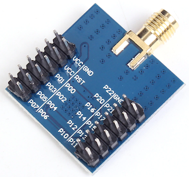

---
---

# Create a CC2530 router
The CC2530 is highly suitable for serving as a router. It has an external antenna which will greatly improve the range of your Zigbee network. This tutorial will explain how to create a CC2530 router packed into a nice enclosure which can be powered via any regular outlet.

**DISCLAIMER:** The CC2530 router will use Mains AC so there is a danger of electrocution if not installed properly. If you don't know how to install it, please call an electrician!

## What do I need?

| Name | Price | Picture |
| ------------- | ------------- | ------------- |
| CC2530   **OR**   CC2530 + CC2591   *The CC2530 + CC2591 is more powerful but more expensive* | +-7.50$ on AliExpress     +-15$ on AliExpress | |
| HLK-PM03 | +-2.20$ on AliExpress |  |
| Enclosure (the one used has the following dimensions: 100x68x40mm) | +-2$ |  |
| Power cable | +-2$ |  |
| CC debugger | - |  |
| 8 female to female jumper wires | - |  |

## Flashing the CC2530
The CC2530 has to be flashed with a router firmware which has to be done with a CC debugger using 6 female to female jumper wires. Pins have to connected as follows:

### CC debugger pin layout

| CC debugger | CC2530 |
| ----------- | ------ |
| 1 | GND |
| 2 | VCC |
| 3 | P2.2 |
| 4 | P2.1 |
| 7 | RST |
| 9 | VCC |

### Pin layout of various CC2530 modules

| Name | Pin layout | Picture |
| ------------- | ------------- | ------------- |
| CC2530 |  | 
| Webee CC2530 + CC2591 |  | 

### Flashing
Now the CC2530 can be flashed using the same instructions as [Flashing the CC2531](../../guide/adapters/flashing/flashing_the_cc2531.md). The router firmwares can be found [here](https://github.com/Koenkk/Z-Stack-firmware/tree/master/router).

## Putting it in an enclosure
The following steps have to be followed:
- Drill 2 holes in the enclosure; one for the antenna, one for the power cable
- Lay a knot in the power cable; this serves as strain relief
- Solder the power cable on to the AC pins of the HLK-PM03
- Use 2 female to female jumper wires to connect the VC+ pin of the HLK-PM03 to the VCC pin of the CC2530 and the VC- pin of the HLK-PM03 to the GND pin of the CC2530
- Use double sided tape to fix the CC2530 and HLK-PM03 into the enclosure

### Result

## Done!
Now plug the CC2530 into a power outlet where it will automatically join your Zigbee network. (don't forget to set `permit_join: true` to enable joining of new devices). Enjoy your extended Zigbee network range! :smile:
