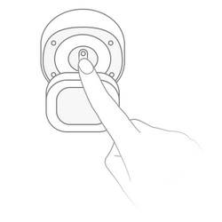

<!-- !!!! -->
<!-- ATTENTION: This file is auto-generated through docgen! -->
<!-- You can only edit the "Notes"-Section between the two comment lines "Notes BEGIN" and "Notes END". -->
<!-- Do not use h1 or h2 heading within "## Notes"-Section. -->
<!-- !!!! -->

# Xiaomi RTCZCGQ11LM

|     |     |
|-----|-----|
| Model | RTCZCGQ11LM  |
| Vendor  | Xiaomi  |
| Description | Aqara presence detector FP1 (regions not supported for now) |
| Exposes | presence, presence_event, monitoring_mode, approach_distance, motion_sensitivity, reset_nopresence_status, device_temperature, power_outage_count, linkquality |
| Picture |  |

<!-- Notes BEGIN: You can edit here. Add "## Notes" headline if not already present. -->
## Notes

### Channel
This sensor [does not work](https://github.com/Koenkk/zigbee2mqtt/issues/11019#issuecomment-1064063808) on Zigbee channel 21-24.

### Adapter firmware
In order for this device to work, at least the following firmware is required on your adapter:
- CC2530/CC2531: [`20211115`](https://github.com/Koenkk/Z-Stack-firmware/tree/Z-Stack_Home_1.2_20211115/20211116/coordinator/Z-Stack_Home_1.2/bin)
- CC1352/CC2652: [`20211114`](https://github.com/Koenkk/Z-Stack-firmware/tree/7c5a6da0c41855d42b5e6506e5e3b496be097ba3/coordinator/Z-Stack_3.x.0/bin)
- CC2538: [`20211222`](https://github.com/jethome-ru/zigbee-firmware/tree/master/ti/coordinator/cc2538_cc2592)
- Conbee II: [`0x26720700`]( http://deconz.dresden-elektronik.de/deconz-firmware/deCONZ_ConBeeII_0x26720700.bin.GCF)

*Note that if you have already paired the device you will need to repair it after upgrading your adapter firmware.*

### Pairing
Press and hold the reset button on the device for +- 5 seconds (until the blue light starts blinking).
After this the device will automatically join. If this doesn't work, try with a single short button press.

### Feature support
`Regions` [not supported](https://github.com/Koenkk/zigbee2mqtt/issues/11019#issuecomment-1026012894) for now.
<!-- Notes END: Do not edit below this line -->

## OTA updates
This device supports OTA updates, for more information see [OTA updates](../guide/usage/ota_updates.md).

## Options
*[How to use device type specific configuration](../guide/configuration/devices-groups.md#specific-device-options)*

* `device_temperature_precision`: Number of digits after decimal point for device_temperature, takes into effect on next report of device. The value must be a number with a minimum value of `0` and with a with a maximum value of `3`

* `device_temperature_calibration`: Calibrates the device_temperature value (absolute offset), takes into effect on next report of device. The value must be a number.

## Exposes

### Presence (binary)
Indicates whether the device detected presence.
Value can be found in the published state on the `presence` property.
To read (`/get`) the value publish a message to topic `zigbee2mqtt/FRIENDLY_NAME/get` with payload `{"presence": ""}`.
It's not possible to write (`/set`) this value.
If value equals `true` presence is ON, if `false` OFF.

### Presence_event (enum)
Presence events: "enter", "leave", "left_enter", "right_leave", "right_enter", "left_leave", "approach", "away".
Value can be found in the published state on the `presence_event` property.
It's not possible to read (`/get`) or write (`/set`) this value.
The possible values are: `enter`, `leave`, `left_enter`, `right_leave`, `right_enter`, `left_leave`, `approach`, `away`.

### Monitoring_mode (enum)
Monitoring mode with or without considering right and left sides.
Value can be found in the published state on the `monitoring_mode` property.
To read (`/get`) the value publish a message to topic `zigbee2mqtt/FRIENDLY_NAME/get` with payload `{"monitoring_mode": ""}`.
To write (`/set`) a value publish a message to topic `zigbee2mqtt/FRIENDLY_NAME/set` with payload `{"monitoring_mode": NEW_VALUE}`.
The possible values are: `undirected`, `left_right`.

### Approach_distance (enum)
The distance at which the sensor detects approaching.
Value can be found in the published state on the `approach_distance` property.
To read (`/get`) the value publish a message to topic `zigbee2mqtt/FRIENDLY_NAME/get` with payload `{"approach_distance": ""}`.
To write (`/set`) a value publish a message to topic `zigbee2mqtt/FRIENDLY_NAME/set` with payload `{"approach_distance": NEW_VALUE}`.
The possible values are: `far`, `medium`, `near`.

### Motion_sensitivity (enum)
Different sensitivities means different static human body recognition rate and response speed of occupied.
Value can be found in the published state on the `motion_sensitivity` property.
To read (`/get`) the value publish a message to topic `zigbee2mqtt/FRIENDLY_NAME/get` with payload `{"motion_sensitivity": ""}`.
To write (`/set`) a value publish a message to topic `zigbee2mqtt/FRIENDLY_NAME/set` with payload `{"motion_sensitivity": NEW_VALUE}`.
The possible values are: `low`, `medium`, `high`.

### Reset_nopresence_status (enum)
Reset the status of no presence.
Value will **not** be published in the state.
It's not possible to read (`/get`) this value.
To write (`/set`) a value publish a message to topic `zigbee2mqtt/FRIENDLY_NAME/set` with payload `{"reset_nopresence_status": NEW_VALUE}`.
The possible values are: `Reset`.

### Device_temperature (numeric)
Temperature of the device.
Value can be found in the published state on the `device_temperature` property.
It's not possible to read (`/get`) or write (`/set`) this value.
The unit of this value is `°C`.

### Power_outage_count (numeric)
Number of power outages (since last pairing).
Value can be found in the published state on the `power_outage_count` property.
It's not possible to read (`/get`) or write (`/set`) this value.

### Linkquality (numeric)
Link quality (signal strength).
Value can be found in the published state on the `linkquality` property.
It's not possible to read (`/get`) or write (`/set`) this value.
The minimal value is `0` and the maximum value is `255`.
The unit of this value is `lqi`.

