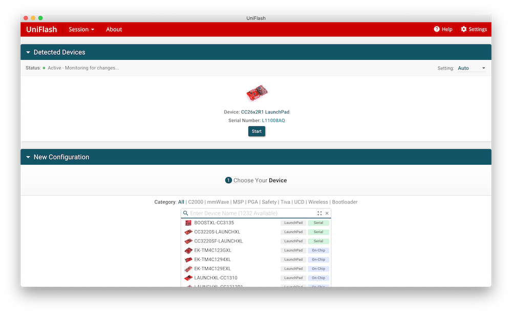

# Flashing via UNIFLASH

UNIFLASH can be used to flash certain Texas Instruments MCUs (e.g. CC26X2R1 and CC1352P-2). It runs on Windows, macOS and Linux.

**n.b.** UNIFLASH sometimes needs to update the programmer firmware, and this can fail if the device is connected to a USB 3 port. If this occurs, switch to a USB 2 port.

**Note for flashing on Linux:** Uniflash does not work well on some distributions. specifically, Fedora 31 may have some issue. Combinations that are verified to be working are:
- *Ubuntu 18.4 (LTS)*:
  - fresh install
  - ```# sudo apt install libgconf-2-4```
  - ```# sudo apt install libusb-0.1-4```
  - ... then follow the instructions below

## Instructions

1. Download and install UNIFLASH: [download link](http://www.ti.com/tool/download/UNIFLASH)
2. Plug your device
3. Start UNIFLASH, your device will automatically be detected, press *Start*

4. Go to *Settings & Utilities* -> *Manual Erase* and press *Erase Entire Flash*

5. Go to *Settings & Utilities* -> *Program Load* and select *All Unprotected Sectors*, click *Perform Blank Check*

6. Go to *Program* -> *Flash Image(s)*, press *Browse* to select the firmware. Ensure that the path and file name do not contain any spaces (otherwise flashing may fail with "Error! Unable to open file ...").
7. Now click *Load image* to upload the firmware

8. Done!
